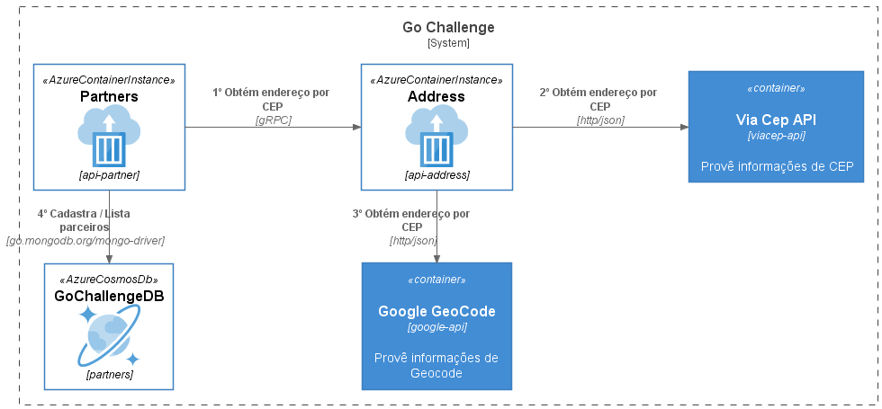

# Go Challenge 
Solução de cadastro de parceiros com integração ViaCep e Google GeoCode.

### Tecnologias Utilizadas
1. [Golang](https://golang.org/)
2. [gRPC](https://grpc.io/)
3. [GraphQL](https://graphql.org/)
4. [Microsoft Azure](https://azure.microsoft.com/pt-br/features/azure-portal/)
5. [Azure Cosmos DB](https://azure.microsoft.com/pt-br/services/cosmos-db/)
6. [Container Instances](https://azure.microsoft.com/pt-br/services/container-instances/)
7. [Github Actions](https://docs.github.com/pt/actions)
8. [Docker](https://www.docker.com/)
9. [Docker Hub](https://hub.docker.com/)

### Desenho da Solução
<p align="center">
  
</p>

1. gRPC
    ```
    protoc --go_out=address/pb --go_opt=paths=source_relative --go-grpc_out=address/pb --go-grpc_opt=paths=source_relative --proto_path=address/protofiles address/protofiles/*.proto
    ```

2. GraphQL
   ```
   go get github.com/99designs/gqlgen
   ```

   ```
   go run github.com/99designs/gqlgen init
   ```

   ```
   go run github.com/99designs/gqlgen generate
   ```
   